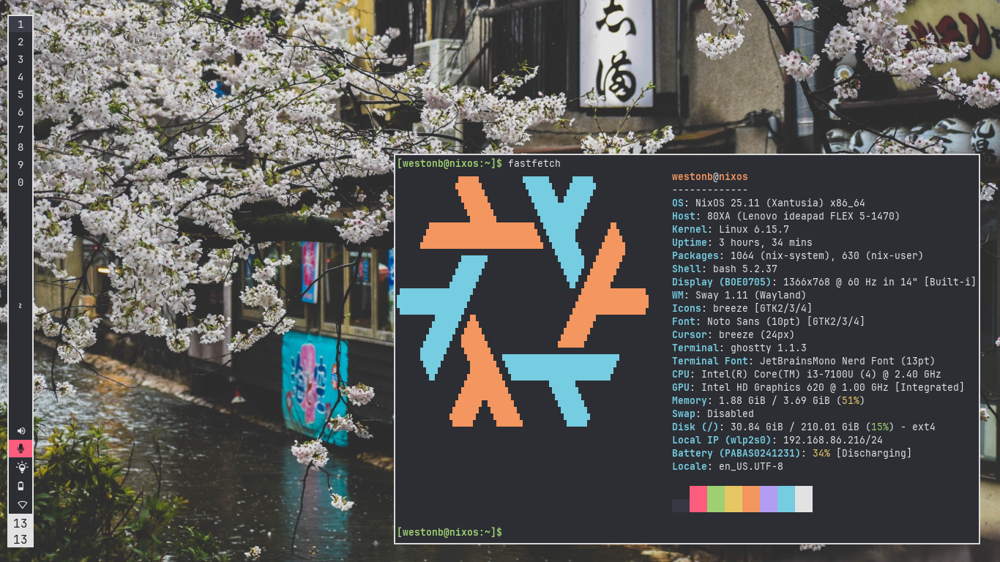

# What Is This:

This is my configuration for NixOS which I run on my PCs. The objective of this
configuration is to be minimal and performant enough to run on weaker hardware,
but be powerful and beautiful enough to run on excellent hardware as well. In
this way I can have the same operating system on any computer, in order to
aligns with the NixOS tenet of reproducibility. It is a full-featured and modern
desktop operating system that comes with a custom theme and is designed for
programming, office use, and gaming. This project is still in an early stage and
many changes will be made for a while to come.

# Screenshot:

# To Do:

- Fix waybar (align)
- add VPNs
- QT Theme
- other terminal utilities and aliases
- password manager
- note taking system (neorg or obsidian)
- waiting for drive issue
